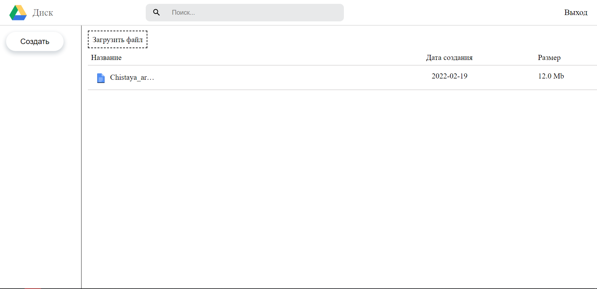

# CLOUD DISK

:warning: Проект не до конца закончен, есть моменты, которые нужно поправить, это всего лишь базовая версия.

При разработки сайта использовался стек MERN:

Frontend:
  1. React
  2. Scss
  3. Typescript
  4. Redux/toolkit
  
Backend:
  1. Express
  2. NodeJS
  3. bcryptjs
  4. typescript
  5. mongoose
  6. nodemon
  7. jsonwebtoken
  8. express-fileupload
  9. express-validator
  
DataBases:
  1. MongoDB
